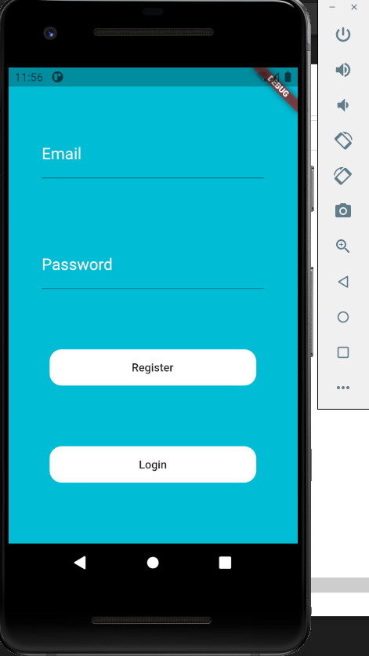
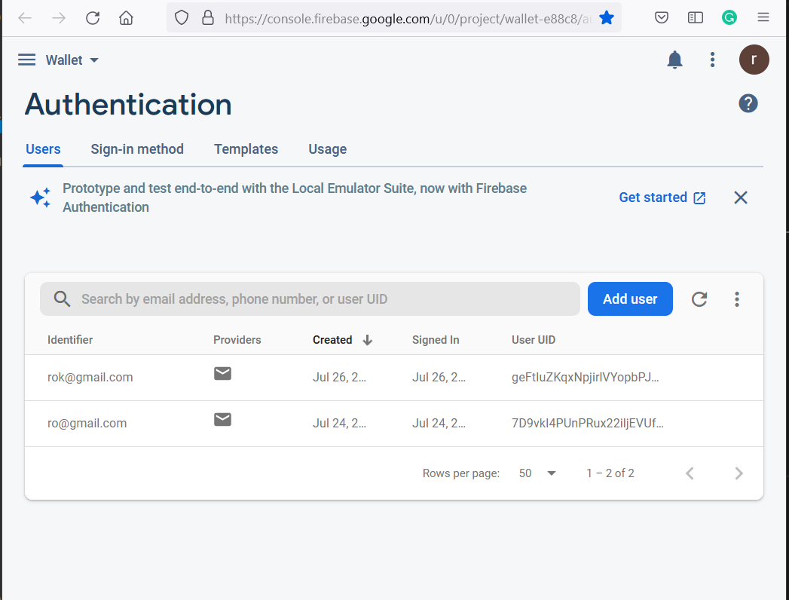
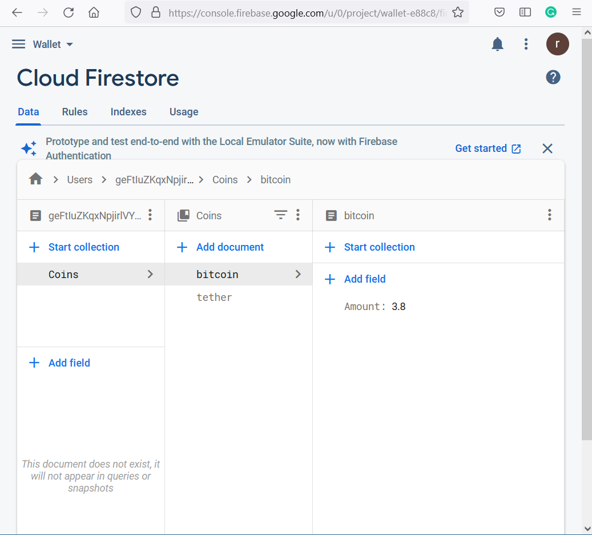
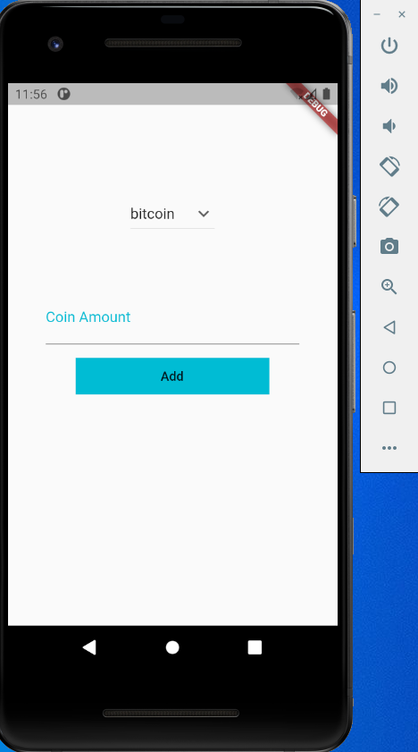

# Wallet_Application

A new Flutter project.
## logic of this project is login or register if you dont have email on the application yet and it will shows amount of coins you have in your account 
### there are more one type of coins :
* Bitcoin
* Ethereum
* Tether

### and each one equal specific amount relatively with the Country and the type of the coin 

### There is a button to add coins from any type 
### In this Project I worked with Firebase Authentication, Cloud Firestore and open source APIs.
#

## These are some images for the application step by step:

## Login Page

## Database of Accounts 

## Home Page after logingin

## Cloud Firestore contain amount of coins for each type

## Add Page

